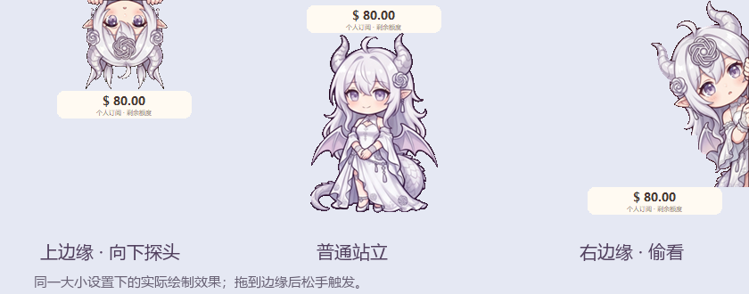

# LMService 龙娘桌宠

Windows 原生龙娘桌宠，用来查看 LMService 个人订阅剩余额度、今日使用量与站点总额度。

基于 WinForms，独立运行，不需要打开 Codex 或浏览器。当前版本：**1.2.5**。


角色素材来自用户提供的六状态参考图。卡片截图为演示数据，来自 1.2.3。

首次安装默认使用 75% 大小，已有安装继续使用保存的大小设置。桌面和托盘使用带紫色边框的龙娘头像图标。

| 姿态 | 触发方式 |
| --- | --- |
| 站立 | 待机 |
| 魔法 | 刷新额度时 |
| 点击 | 点击桌宠，短暂反馈 |
| 甜点 | 登录后刷新成功，短暂反馈 |
| 拖动 | 拖拽桌宠时 |
| 睡觉 | 90 秒无桌宠操作后 |

把桌宠拖到桌面工作区的上边缘或右边缘后松手，会自动吸附并换成藏在边缘偷看的姿态。上边缘向下探头，右边缘从右侧探头；拖回桌面中间恢复原来的六种状态。靠边时仍可点击查看额度，重启后记住靠边位置。

上边缘素材由 Gemini 网页根据同一角色重新绘制倒挂探头与双手抓握姿势，经补全发梢、透明背景处理和边缘对齐后使用。头部大小按普通站立姿态匹配，避免头部素材铺满全身画布而显得过大。右边缘素材取自用户提供的侧面偷看图。




[](https://github.com/Jerryren5268/token_quantity_monitor/releases)
[](https://github.com/Jerryren5268/token_quantity_monitor/releases/latest)

累计访问次数由第三方 Hits.sh 提供，自 2026-10-01 接入后持续累计，不按 14 天清零，无法补回接入前的数据。该数值统计计数图片的请求，不等于独立访客人数；重复访问、机器人及 GitHub 图片缓存会影响结果，依赖第三方服务可用性。

下载徽章统计 GitHub Releases 附件的下载次数，包含重复下载，不代表独立下载人数或安装人数；不包含自动生成的 Source code 下载。徽章有缓存，更新可能延迟。

## 功能

- 桌宠头顶常驻显示个人订阅余额，点击展开额度卡片。
- 个人额度、今日已用、站点额度与再次订阅入口集中在同一页。
- 自动刷新可设为 1–1440 分钟；也可选择仅手动刷新。
- 桌宠大小支持 50%–200%，支持拖动、记住位置、置顶及隐藏到托盘。
- 检测到今日用量增加时播放扣钱动画。
- 有有效重置时间时显示倒计时。
- 账号密码登录，支持网站的二次验证流程。会话通过 Windows DPAPI 当前用户加密保存，不保存密码或验证码。

## 安装

从 [Releases](https://github.com/Jerryren5268/token_quantity_monitor/releases) 下载 Windows x64 安装包，完整解压后双击 `安装并启动.cmd`。GitHub 的 “Source code” 压缩包只含源码，不是可直接运行的安装包。
更新前请先右键桌宠退出。安装会添加桌面快捷方式和 Windows 登录启动项，并保留已有设置与登录状态。

需要 Windows 10/11 x64 与 .NET Framework 4.8。发行包包含 Python 3.12 运行时，无需安装 Codex。

## 日常使用

1. 首次启动，点击桌宠，在账户入口用网站账号密码登录；需要时输入二次验证码。
2. 桌宠头顶显示有效订阅剩余额度，多份有效订阅合计。点击桌宠展开卡片，查看今日已用和站点总额度。
3. 在“设置”中选择自动刷新间隔或仅手动刷新，也可调整桌宠大小。
4. 点击“再次订阅”选择套餐，核对名称和价格后确认。是否恢复额度以网站规则为准。

| 操作 | 效果 |
| --- | --- |
| 点击桌宠 | 展开或收起卡片 |
| 拖动桌宠 | 移动并记住位置 |
| 右键桌宠 | 查看额度、设置、置顶、隐藏到托盘或退出 |
| 托盘菜单 | 恢复桌宠或退出程序 |

自动模式默认每 5 分钟刷新，启动和展开卡片时也刷新。手动模式下启动、展开均不读取额度，点击“刷新”才读取；登录或订阅成功后仍更新相关额度。账户输入和订阅确认期间暂停自动刷新，隐藏到托盘仍按所选模式运行。动画和本地倒计时不会产生网络请求。

## 本地数据与卸载

| 路径 | 内容 |
| --- | --- |
| `%LOCALAPPDATA%\LMServiceQuota\App` | 安装程序及运行时 |
| `%LOCALAPPDATA%\LMServiceQuota\settings.json` | 刷新、位置和大小设置 |
| `%LOCALAPPDATA%\LMServiceQuota\session.dpapi` | 当前 Windows 用户加密的登录会话 |

密码与验证码不写入文件；退出账户会清除会话。不要将个人会话文件提交到仓库。更新程序保留登录状态与设置。

关闭开机启动：按 `Win+R`，输入 `shell:startup`，删除其中的“LMService 额度”快捷方式。卸载时先退出桌宠，再删除启动项、桌面快捷方式和上表的应用目录；删除整个 `LMServiceQuota` 文件夹也会清除登录与设置。

## 从源码构建

在 Windows PowerShell 中运行：

```powershell
.\build.ps1
```

构建使用系统的 .NET Framework C# 编译器。运行时需在程序旁放置 `runtime\python.exe` 和完整的 Python 标准库；开发环境也支持已安装的 Codex Python 运行时路径。

源码结构：

| 文件 | 用途 |
| --- | --- |
| `PixelPet.cs` | 桌宠、托盘、位置与缩放 |
| `QuotaCard.cs` | 额度界面、登录和订阅确认 |
| `RefreshSettings.cs` | 刷新和大小设置 |
| `SpendBubble.cs` | 扣钱动画 |
| `account_service.py` | 账户接口、会话加密与用量统计 |
| `AccountPipe.cs` | 界面与账户进程之间的私有管道 |

## 统计口径

今日已用按北京时间当天 00:00 起的账户 API 消耗统计，包含钱包及订阅计费。动画显示两次刷新之间的消耗增量。
它不等于订阅余额减少量，也不包含购买套餐金额。首次刷新、跨日或旧数据不会触发扣钱动画。

重置倒计时只使用订阅接口返回的 `next_reset_time`。未提供时隐藏，倒计时结束后等待下一次读取确认，不以到期时间推算。站点总额度与个人额度是两个独立指标。
网站接口不可用时保留带标记的旧数据或显示“—”。订阅操作会请求真实扣款，提交前确认套餐名称与价格。

当前适配 `lmservice.lylab.sustcra.com`；站点总额度来自 `newapi.513201.xyz/about-monitor/api/status`。接口或登录验证方式变化可能需要更新适配。

详细操作说明见 [使用说明](使用说明.md)。随发行包提供的 Python 运行时许可位于 `runtime/LICENSE.txt`。

## 常见问题

- **找不到桌宠**：检查系统托盘，通过菜单恢复；程序只允许运行一个实例。
- **余额显示“—”**：检查登录状态并点击刷新；重启后首次读取前不显示旧余额。
- **今日已用不可用**：网站需支持 `/api/log/self/stat` 接口；程序不会用余额差代替统计结果。
- **提示旧数据**：此次请求失败，显示的是上次结果及时间。恢复网络后再次刷新。
- **再次订阅请求超时**：先在网站核实订单与扣款，再决定是否重试，避免重复购买。

项目目前针对上述网站接口适配，并非通用 API 服务商额度查询工具。
